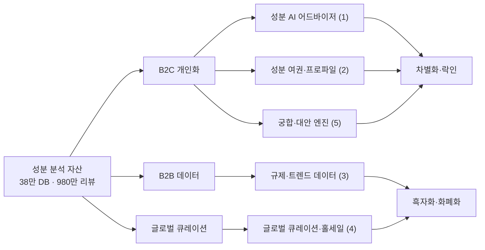

# 성분 분석 자산 활용 아이디어 (Ideation): 화해 (Hwahae)

**작성일**: 2026-06-30
**질문**: 화해의 핵심 자산(**38만 성분 DB + 980만 리뷰 + 성분 분석 역량**)으로 *어떤 제품/기능/사업을 할 수 있는가?*
**방법**: Product Trio 다관점 발상(PM·Designer·Engineer) → 상위 5개 우선순위
**전제**: 전략 방향 = "범용 정보 제공자 → **신뢰 기반 개인화 의사결정 엔진 + 글로벌 큐레이터 + 데이터 화폐화**" ([10 개선제안](./10-improvement-proposal.md))

---

## 0. 자산을 '무엇'으로 보느냐가 출발점

성분 DB는 단순 '정보'가 아니라 **3가지 레버**로 재해석할 수 있다:
1. **개인화 엔진의 연료** (B2C) — 내 피부 × 성분 매칭 → 락인
2. **검증된 진실의 데이터** (B2B) — 브랜드·제조사·규제·투자자가 돈 내는 정보
3. **신뢰의 글로벌 통화** (Global) — K뷰티를 '믿고' 고르게 하는 큐레이션 기준

---

## 1. 다관점 발상 (15 아이디어)

### 🧭 PM 관점 (비즈니스 가치·전략)
| # | 아이디어 | 가치 |
|---|---|---|
| PM1 | **성분 B2B 데이터 솔루션** — 안전성평가·e-라벨(2026 규제) 대응 + 성분 적합성 리포트 | 신뢰 훼손 없는 화폐화 |
| PM2 | **성분 트렌드 인텔리전스 구독** — "레티날 검색 +500%" 같은 인사이트를 브랜드·투자자·MD에 판매 | 데이터=상품 |
| PM3 | **글로벌 성분 큐레이션(화해 홀세일 연계)** — '성분 신뢰' 기준으로 K뷰티 바이어 매칭 | 시장개발·수출 |
| PM4 | **성분 검증 인증 배지** — 브랜드가 '화해 성분 검증' 마크를 마케팅에 사용(라이선스) | 신뢰 자산 수익화 |
| PM5 | **개인화 성분 매칭 구독(프리미엄)** — 내 피부 맞춤 추천·경고·루틴을 구독화 | 락인+ARPU |

### 🎨 Designer 관점 (경험·몰입)
| # | 아이디어 | 가치 |
|---|---|---|
| D1 | **내 피부 성분 여권** — 알러지·주의 성분 프로파일을 들고 다니며 어디서나 적합도 확인 | 개인화 락인 |
| D2 | **매장 바코드 스캔 → 즉시 성분 신호등** — 올영 매장에서도 화해를 켜게 (초록/노랑/빨강) | 오프라인 침투 |
| D3 | **화장대 관리 + 루틴 충돌 알림** — 내가 쓰는 제품 등록 → 중복·충돌 성분 경고 | 습관·재방문 |
| D4 | **성분 스토리텔링 숏폼** — "이 성분이 왜 좋은가" 1분 영상 (Gen Z 재유입) | 콘텐츠 전환 |
| D5 | **"왜 추천?" 투명 설명** — 추천마다 성분 근거를 보여줘 신뢰 강화 | 신뢰 차별화 |

### ⚙️ Engineer 관점 (데이터·AI·확장)
| # | 아이디어 | 가치 |
|---|---|---|
| E1 | **성분×리뷰 자연어 AI 어드바이저** — "민감성인데 이거 써도 돼?" 대화형 답변 | 올영 AI리뷰 대비 성분 깊이 |
| E2 | **사진 기반 피부 진단 → 성분 추천** (CV + 매칭) | 진입장벽↓·개인화 |
| E3 | **성분 궁합/충돌 엔진** — 레티놀+AHA 등 조합 경고, 루틴 빌더 | 고유 기능 |
| E4 | **성분 OCR 자동 등록 + 이상 탐지** — 신제품 DB 자동 확장·신선도 유지 | 데이터 해자 강화 |
| E5 | **성분 임베딩 '대안 추천'** — "이것과 성분 비슷한 더 순한/저렴한 제품" | 디커플링 방어(대안탐색 가두기) |

---

## 2. 상위 5개 우선순위 (Top 5)

선정 기준: **전략 정합 · 차별화(올영 대비) · 락인/화폐화 임팩트 · 실현가능성**

### ⭐ 1. 성분 × 리뷰 자연어 AI 어드바이저 (E1 + D5)
- **한 줄**: "건성에 트러블 있는데 이 제품 써도 돼?"에 **성분 DB + 980만 리뷰 근거로 대화형 답변**하는 AI.
- **왜**: 올리브영 AI리뷰가 '리뷰 요약'이라면, 화해는 **성분 인과까지 설명**할 수 있는 유일한 곳. 06-B1의 '유일한 10배 축(신뢰×개인화)'을 제품화. JTBD("실패 없는 선택")의 정면 해결.
- **검증 가정**: ① 유저가 자연어로 묻는다, ② 성분+리뷰 근거 답변이 신뢰를 높인다, ③ 환각 없이 안전하게 답할 수 있다(성분=사실 기반이라 유리).

### ⭐ 2. 내 피부 성분 여권 + 개인 프로파일 매칭 (D1 + PM5)
- **한 줄**: 내 피부타입·알러지·주의 성분을 **프로파일로 축적**, 모든 제품에 '나 기준' 적합도를 표시하고 구독화.
- **왜**: 전환비용 0(락인 부재) 문제의 정답. **데이터를 쌓을수록 못 떠나는** 구조(Hook의 Investment). 09-U3(설문 즉시 보상)·10-P1과 직결.
- **검증 가정**: ① 유저가 프로파일을 채울 동기가 있다(즉시 보상 제공 시), ② 맞춤 적합도가 구매 결정을 바꾼다, ③ 구독 지불의사 존재.

### ⭐ 3. 성분 B2B 데이터·규제 솔루션 (PM1 + PM2)
- **한 줄**: 38만 성분 데이터를 **안전성평가·e-라벨(2026 규제) 대응 + 트렌드 인텔리전스**로 브랜드·제조사·투자자에 판매.
- **왜**: **신뢰를 훼손하지 않는 화폐화**(커머스 푸시의 양패를 회피). 본업 흑자화의 핵심(10-P2). 규제 시행(2026)이 수요를 만든다.
- **검증 가정**: ① 브랜드가 규제·인사이트에 돈을 낸다, ② 화해 데이터가 그 용도로 충분히 정합·신뢰된다, ③ B2B 세일즈 역량 확보 가능.

### ⭐ 4. 글로벌 성분 큐레이션 (PM3 + 화해 홀세일)
- **한 줄**: '성분 신뢰' 기준으로 검증한 K뷰티를 **해외 바이어·소비자에게 큐레이션**(홀세일·영문 웹 연계).
- **왜**: 국내 레드오션(올영 독점) 회피 + K뷰티 수출 1위 모멘텀 활용. 회사가 이미 착수(홀세일) → 분석과 정합, 확장 여지.
- **검증 가정**: ① 해외 바이어가 '화해 검증'을 신뢰 기준으로 받아들인다, ② 성분 데이터의 글로벌 정합(규제·표기 차이) 해결, ③ 매칭이 실제 거래로 전환.

### ⭐ 5. 성분 궁합·대안 추천 엔진 (E3 + E5)
- **한 줄**: 루틴 내 **성분 충돌 경고**(레티놀+AHA) + "이것과 성분 비슷한 더 순한/저렴한 대안" 추천.
- **왜**: 화해만의 고유 기능(올영·쿠팡 불가) + **대안 탐색을 화해 안에 가둬 디커플링 방어**. 락인·재방문 동인.
- **검증 가정**: ① 유저가 '궁합/대안'을 가치로 느낀다, ② 추천 정확도가 신뢰를 준다, ③ 대안 추천이 화해 내 행동(저장·구매)으로 이어진다.

---

## 3. 한눈에 — 자산 → 방향 매핑

---

## 4. 종합 시사점
- **B2C 3개(1·2·5)** = 올영 대비 차별화 + 락인 → *생존(이탈 방지)*의 무기.
- **B2B·글로벌 2개(3·4)** = 신뢰 훼손 없는 화폐화 → *흑자화*의 엔진.
- 공통 원천은 단 하나: **"성분 = 검증 가능한 사실"** → AI 환각에 강하고, 커머스가 흉내 못 내는 신뢰. 이 자산을 *정보 진열*이 아니라 *개인화 판단·데이터 상품·글로벌 신뢰 기준*으로 전환하는 것이 핵심.

---

## 5. 다음 단계 (검증)
- Top 1·2(AI 어드바이저·성분 여권)는 **저비용 프로토타입 + 코어 유저(S1) 테스트**로 가정 검증 가능 → [10-개선제안](./10-improvement-proposal.md)의 P0-B·P1과 연결.
- Top 3·4(B2B·글로벌)는 **파일럿 1~2건**(브랜드/바이어)으로 지불의사·전환 검증.

*프레임워크: [W1](../../frameworks/W1-company-analysis-frameworks.md) · 분석 인덱스: [README](./README.md)*
