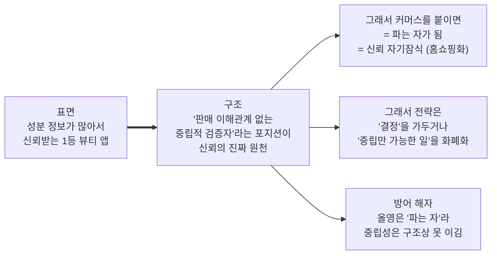

# 구조적 재해석 (Surface → Structure): 화해 (Hwahae)

**작성일**: 2026-06-30
**방법**: [표면→구조→본질 메커니즘 사고법](../../frameworks/analysis-method-surface-to-structure.md)을 화해에 적용
**목적**: 기존 분석(00~11)을 "현상"에서 "구조적 본질"로 한 단계 격상
**핵심 역발상**: *"성분 정보 = 신뢰가 맞나?"*

> 당근 분석이 "동네=신뢰"를 뒤집어 **억제(deterrence)**를 찾았듯, 화해의 "성분 정보=신뢰"를 뒤집어 진짜 메커니즘을 찾는다.

---

## ① 주장가치 vs 체감가치 분리

| | 내용 |
|---|---|
| **화해 주장** | "대한민국 1등 뷰티 앱", "성분을 해석한다", "광고 없는 진짜 리뷰" = *신뢰 기반 뷰티 의사결정 플랫폼* |
| **체감가치 (코어 S1)** | "내 피부에 안 맞는 성분을 피해 실패를 줄인다" (성분 팩트체크 도구) |
| **체감가치 (다수 S2)** | "여기서 확인하고 구매는 올영/쿠팡" (쇼루밍) |
| **최근 신호 (08)** | "어플이 그냥 홈쇼핑이 되어버렸다" (배신감) |

**Gap**: 화해는 *"큐레이션 플랫폼"*을 주장하지만, 유저는 *"성분 팩트체크 도구"*로 쓰고 거래는 딴 데서 한다. 그리고 커머스 푸시로 그 도구 신뢰마저 흔들린다.

---

## ② 개념 분해 — "신뢰"를 쪼개기

화해의 "신뢰"도 당근처럼 뭉뚱그려져 있다. 쪼개면:

| 신뢰의 종류 | 질문 | 화해가 풀었나? |
|---|---|---|
| **정보 신뢰** | "이 성분·리뷰가 정확한가?" | ✅ 풀었다 (핵심) |
| **추천 신뢰** | "이게 *나에게* 맞나?" | 🟡 부분 (개인화 약함) |
| **거래 신뢰** | "여기서 사도 되나? 가격·배송은?" | ❌ 못 풀었다 (올영/쿠팡 우위) |

→ 화해가 실제 푼 건 **1단계(정보 신뢰)뿐**. *(당근이 "거래신뢰만 풀고 관계신뢰는 미검증"이던 것과 평행 구조)*

---

## ③ 역발상 — "성분 정보 = 신뢰가 맞나?" ⭐

**통념**: "화해는 성분 정보가 많아서(38만 DB) 신뢰받는다."

**뒤집기**: 정보의 *양*이 신뢰의 원천인가? **아니다.** 올리브영도 4,700만 리뷰 + AI 요약으로 정보량은 오히려 더 많다. *정보량이 해자라면 올영이 이미 이겼어야 한다.* 그런데 유저는 여전히 "성분은 화해에서 본다"고 한다. 왜?

**진짜 메커니즘 = 판매 이해관계로부터의 독립성 (disinterestedness / 중립성)**
- 화해는 (원래) 그 제품을 **팔지 않으니까** 성분 평가에 사심이 없다.
- 올영·쿠팡·브랜드몰의 리뷰·추천은 **"팔려는 자"의 정보**라 구조적으로 의심받는다.
- 즉 화해 신뢰의 원천은 *"정보가 많아서"*가 아니라 **"이해관계가 없어서"** 다.

> **당근과 정확히 평행한 구조**:
> - 당근: 감성("따뜻함")이 아니라 **구조(도망 못 감 = 억제)**가 신뢰를 만든다.
> - 화해: 감성("정보 풍부")이 아니라 **구조(이해관계 없음 = 중립성)**가 신뢰를 만든다.

---

## ④ 자산 재정의 (+ 자기잠식)

**재정의**:
> 화해의 진짜 자산은 *"방대한 성분 DB"*가 아니라 **"판매 이해관계 없는 중립적 검증자라는 구조적 포지션"** 이다. DB·리뷰는 그 포지션의 *결과물·연료*일 뿐.

**⚠️ 자기잠식 (가장 중요한 통찰)**:
- 커머스·PB를 붙이는 순간 화해는 **"파는 자"가 된다 → 중립성(=신뢰의 원천) 붕괴.**
- 08의 *"홈쇼핑이 되어버렸다"*는 **미관 불만이 아니라 신뢰 메커니즘의 구조적 붕괴 신호**다.
- PB(비플레인) 운영기엔 *"성분 좋다고 추천하는 걸 자기가 판다"*는 **이해상충(conflict of interest)**을 안고 있었다.
  → **PB 매각(07)을 재해석**: 단순 재무 이벤트가 아니라 *이해상충을 덜어낸 = 중립성 회복*의 사건. (단, 화해쇼핑 커머스는 여전히 이해상충 잔존)

> **당근과 동일한 자기잠식 패턴**: 당근=수익화가 *억제*를 침식 / 화해=수익화가 *중립성*을 침식. **둘 다 핵심 자산을 수익화로 소모하는 구조.**

---

## ⑤ CVC × 디커플링 — 본질로 기회 재탐색

화해의 무기 = **중립적 검증**. 뷰티 구매 가치사슬:
`인식 → 탐색 → 평가/검증 → 선택 → 구매 → 사용 → 재구매`

- **화해가 푼 단계**: 평가/검증 (성분 중립 검증)
- **빼앗긴 단계**: 구매 (올영/쿠팡으로 디커플링당함 = '무료 쇼룸')

**전략은 두 갈래 — 둘 다 "중립을 지키며"**:

| 전략 | 내용 | 근거 |
|---|---|---|
| **(a) '결정'을 가둔다** | 구매는 어디서 하든, **"무엇을 살지 결정"을 화해에서 끝나게** (개인화 매칭). 당근이 *거래*를 가뒀듯 화해는 *결정*을 가둠 | 11-Top2, 10-P1 |
| **(b) 중립을 화폐화** | **"파는 자는 못 하는 일"**만 판다 — 인증 배지·규제·트렌드 데이터 B2B | 11-Top3 |

**핵심**: 화해가 커머스(파는 자 영역)로 가면 ① 올영과 정면충돌 + ② 자기잠식. 대신 **"중립 검증자만 할 수 있는 영역"**으로 디커플링해야 한다.
*(당근 비즈프로필 비판 — "광고 표시 의무화·실구매자만 리뷰" — 과 평행: 수익화하되 중립 구조를 깨지 않는 설계)*

---

## ⑥ 회의적 검증 — 진짜 Job은 충분히 큰가?

- **리스크**: "성분 중립 검증"의 Job이 줄고 있다. Gen Z는 검증을 건너뛰고 숏폼·감성으로 간다(01·08). → *중립 검증 수요 자체의 축소*.
- **그러나 살아있는 Job**: ① 민감성·트러블 피부(S1), ② 글로벌 K뷰티 비소비자(*믿고 못 사던* 해외 소비자)에겐 중립 검증 Job이 **여전히 크다**. → **타겟을 좁혀야**(beachhead).
- **방어 가능 해자**: 올영 AI리뷰는 구조상 **"파는 자의 추천"**이라 중립성에선 화해를 못 이긴다. ← *여기가 화해가 지킬 수 있는 유일한 땅.*

---

## 종합 — 한 문장 격상

> **기존 분석(06)의 "유일한 10배 축 = 신뢰×개인화"에서, 그 '신뢰'의 구조적 정체를 규명했다 — 그것은 '정보량'이 아니라 '중립성(disinterestedness)'이다.**
> 따라서 화해의 모든 의사결정은 **"이것이 우리의 중립성을 강화하는가, 침식하는가?"** 라는 단 하나의 질문으로 평가되어야 한다.

**이 재해석이 바꾸는 것**:
1. "홈쇼핑화"(09) = UX 문제 → **신뢰 메커니즘의 구조적 붕괴**로 격상
2. PB 매각(07) = 재무 이벤트 → **중립성(이해상충 해소) 회복**으로 재해석
3. "신뢰-커머스 분리"(10-P0A) = UX 위생 → **핵심 자산 방어**라는 전략 1순위로 격상
4. 화폐화(10-P2)의 원칙 = "수익 다변화" → **"중립을 깨지 않는 수익만"** 으로 정밀화

---

*방법: [analysis-method](../../frameworks/analysis-method-surface-to-structure.md) · 분석 인덱스: [README](./README.md)*
