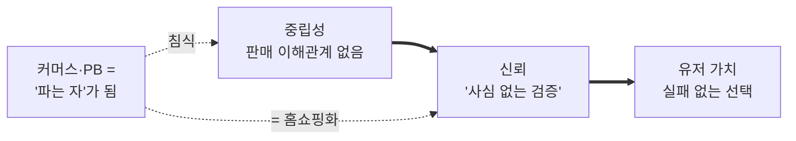

# 화해 = '중립성' 비즈니스 — 발표용 1-pager

**한 줄 테제**: *화해의 진짜 자산은 '38만 성분 DB'가 아니라 **"팔지 않기에 사심 없는 중립적 검증자"라는 구조적 포지션**이다. 화해의 모든 의사결정은 단 하나의 질문으로 판단된다 — **"이것이 우리의 중립성을 강화하는가, 침식하는가?"***

**근거**: [기업 분석 00~12](./README.md) · **방법**: [표면→구조 사고법](../../frameworks/analysis-method-surface-to-structure.md) · 2026-06-30

---

## ① 통념을 뒤집다

> **통념**: "화해는 성분 정보가 *많아서* 신뢰받는다."
> **반례**: 올리브영은 리뷰 4,700만 건 + AI 요약으로 **정보량이 더 많다**. 정보량이 해자라면 올영이 이미 이겼다. 그런데 유저는 여전히 *"성분은 화해에서 본다."*
> **∴ 진짜 원천**: 정보의 *양*이 아니라 **중립성(disinterestedness)** — 화해는 *팔지 않으니까* 사심이 없다. 올영·쿠팡·브랜드몰의 추천은 **"파는 자의 정보"**라 구조적으로 의심받는다.

---

## ② 위기: 핵심 자산을 스스로 태우고 있다 (자기잠식)

- 적자 탈출(2025 본업 매출 214억·**영업손실 95억**)을 위해 **커머스를 밀었다.**
- 그 순간 화해는 **"파는 자"가 된다 → 중립성(=신뢰의 원천) 붕괴.**
- 유저 증언 *"어플이 그냥 홈쇼핑이 되어버렸다"* = 미관 불만이 아니라 **신뢰 메커니즘의 구조적 붕괴 신호.**

> **당근과 동일한 패턴**: 당근은 *수익화가 '억제'를 침식* / 화해는 *수익화가 '중립성'을 침식*. 둘 다 **핵심 자산을 수익화로 소모하는 구조.**

---

## ③ 주장가치 vs 체감가치 (중립성 렌즈)

| 화해가 주장 | 유저가 체감 | 중립성 관점 |
|---|---|---|
| 1등 뷰티 *커머스* 플랫폼 | 성분 *팩트체크 도구* | 신뢰는 '검증'에서 나옴, '판매' 아님 |
| 좋은 제품을 *팔아줌* | 확인은 화해, 구매는 올영/쿠팡(쇼루밍) | '파는 자' 경쟁은 중립성·가격 모두 패배 |
| 다양한 혜택·할인 | "홈쇼핑이 됐다"(배신감) | 할인 푸시 = 중립성 침식 신호 |

---

## ④ 전략: 모든 선택을 '중립성'으로 거른다

| | 원칙 | 실행 |
|---|---|---|
| 🛡️ **지킨다** | 중립적 검증 포지션 | 첫 화면=성분/검증, 커머스 분리 (10-P0A) |
| 🔒 **가둔다** | *거래*가 아니라 **'결정'**을 | 개인 스킨 프로파일 × AI 성분매칭 (11-Top2) |
| 💰 **판다** | **"파는 자는 못 하는 것"**만 | 인증 배지·규제(e-라벨)·트렌드 데이터 B2B, 글로벌 큐레이션 (11-Top3·4) |
| 🗑️ **버린다** | 직접 커머스 가격경쟁 | 올영·쿠팡과 할인 싸움 = 자기잠식+패배 |

> **재해석된 의미**: PB 매각(07)은 재무 이벤트가 아니라 **이해상충 해소 = 중립성 회복**. 다음 과제는 *화해쇼핑의 이해상충*도 같은 렌즈로 정리하는 것.

---

## ⑤ 의사결정 필터 (한 장으로 들고 다닐 것)

> **신제품·기능·수익모델을 검토할 때:**
> ✅ *중립적 검증자만 할 수 있는 일인가?* → 한다
> ❌ *'파는 자'가 되어야 가능한 일인가?* → 중립성을 깨므로 신중/회피
> 🎯 *방어 해자*: 올영은 구조상 '파는 자'라 **중립성에선 화해를 못 이긴다** — 여기가 지킬 유일한 땅

---

## 핵심 숫자 (앵커)
- 본업 매출 **214억(−25.5%)** · 영업손실 **−95억** · 현금 372억(런웨이) · 앱 4.68(31,791)
- 시장 TAM 9~10조 / SAM 2조 / 본업 SOM ~200억(SAM의 ~1%)

---

*분석 인덱스: [README](./README.md) · 종합(일반): [00-executive-summary](./00-executive-summary.md) · 구조 분석: [12-structural-reframe](./12-structural-reframe.md)*
