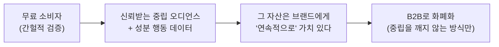

# 비즈니스 모델 고찰: 중립성을 어떻게 돈으로 바꾸나 — 화해

**작성일**: 2026-06-30
**질문**: 중립성이 화해의 진짜 가치라면, 사람들이 *돈을 지불하고서라도* 쓰게 하려면 무엇을 충족시켜야 하고, 화해는 어떻게 벌어야 하나?
**연계**: [12 구조적 재해석(중립성)](./12-structural-reframe.md) · [11 성분자산 발상](./11-ingredient-asset-ideation.md)

> 이 문서는 여러 턴의 대화로 *함께* 도출한 결론. AI는 도구, 판단·반박은 분석자 본인. (실습 원칙)

---

## 1. 출발 직관 — 사람들은 '안전 욕구'로 들어온다

유저는 화해에서 **"좋은 화장품을 찾으려는 = 실패를 피하려는 방어 욕구(안전)"**로 시간을 보낸다.
→ W1 5대 욕구 중 **방어 욕구**. 그리고 여기에 결정적 구조가 있다:

| 욕구 | 누가 더 잘하나 |
|---|---|
| **욕망**(예뻐지기) | '파는 자'(올영·인플루언서)가 더 잘 자극 |
| **방어**(실패·위험 피하기) | '파는 자'는 구조적으로 못 함(이해상충) → **오직 중립자만** |

> **∴ 화해의 중립성이 유일하게 독점할 수 있는 욕구 = '방어'.** 화해는 *'예뻐짐'이 아니라 '실패하지 않음'을 파는 회사* — 보험에 가깝다. (방어욕구 사업 = 보험·보안·법률)

---

## 2. 그런데 'B2C 구독'은 안 된다 — 간헐성의 벽

- 화해의 핵심 행동 = **'구매 전 검증'** → ① 구매 빈도에 묶이고(자주 안 삼) ② 그 구매조차 화해 밖(올영/쿠팡)에서 일어남.
- → 가치 발생이 **드물고 + 화해 밖에서** 일어남. **구독(매일 쓰는 가치에 붙는 과금)은 잘못된 악기.**

**결론**: 소비자에게 직접 받는 건 포기. **소비자는 무료로 둔다.**

---

## 3. 발상의 전환 — 무료 소비자는 '실패한 과금 대상'이 아니라 '자산'



- 소비자의 안전 욕구는 **간헐적**, 그러나 브랜드의 욕구는 **연속적**(항상 증명·인증·트렌드를 원함 + 예산 보유).
- → **빈도-가치 불일치가 "과금 대상을 소비자→공급자로 옮겨라"고 말해준다.**
- 무료 소비자가 ① 중립성을 지키고 ② 오디언스를 키우고 ③ 그 오디언스가 B2B를 비싸게 만든다 — 세 개가 한 번에 풀림.

---

## 4. 함정 — '심판이 받는 돈'(issuer-pays)

B2B라고 다 안전하지 않다. **내가 심판하는 자(브랜드)가 내게 돈을 내면 중립성이 죽는다.**
= 신용평가사가 빠진 함정(발행사가 돈 내니 등급이 후해짐 → 2008). → B2B 수익도 **"심판 대상과 돈 내는 자가 얼마나 분리되나"**로 줄 세워야.

---

## 5. 그냥 '트렌드'는 안 팔린다 — 회사가 못 가진 정보를 줘야

브랜드는 이미 선호도·트렌드 조사를 한다("좋아하세요?" 설문 / 자사 판매 데이터). → 범용 트렌드는 돈 안 됨.
**화해만 가진 것 = 물어본 게 아니라 실제로 일어난 일** (성분 단위 · 피부타입별 · 중립 맥락):

| 화해만의 데이터 | 회사가 못 만드는 이유 |
|---|---|
| **① 성분 배합 R&D 데이터** — 어떤 피부타입이 어떤 성분/조합에서 효과·트러블 | 자사 제품만 봄 vs 화해는 38만 전체 |
| **② "왜 안 샀나" 거절 데이터** — 어떤 성분 때문에 망설이고 거름 | 판매 데이터는 *산 사람*만 보여줌 |
| **③ 부작용 조기 경보** — 트러블 신고가 판매 하락 *전에* 포착 | 화장품판 레이더, 중립·이른 신호 |
| **④ 망설임(dwell) 데이터** — 성분 목록 어디서 오래 머물고 이탈하나 | 단, '걱정' 맥락이라 순수 의도 신호 |

> 비유: 회사는 "합격할 것 같아요?"(설문)를 묻고, 화해는 **전국민 실제 성적표**(반응)를 들고 있다.
> = "트렌드"가 아니라 **"시장 전체의 진짜 피부 반응 데이터"** = 시장조사와 거대 임상의 중간, 회사가 돈 주고도 못 사는 것.

⚠️ **단, ④ 행동 데이터는 반드시 익명·집계로만.** ("김아무개가 봤다" ❌ → "건성 유저 30%가 이 성분에서 이탈" ⭕) 개인 추적해 팔면 = 감시 앱 = 신뢰 사망.

---

## 6. 수익 모델 — 중립 안전도 순으로

| 수익원 | 무엇을 파나 | 중립 안전도 | 수요 |
|---|---|---|---|
| **① 데이터·인사이트** | 성분 반응·거절·망설임 (집계) | 🟢 최고(개별 제품 심판 안 함) | 연속 |
| **② 규제 컴플라이언스** | 안전성평가·e라벨(2026 의무) 대행 | 🟢 높음(기준은 법) | 강제 |
| **③ 글로벌 매칭(홀세일)** | 검증된 K뷰티 ↔ 해외 바이어 | 🟡 중(기준=검증이면 OK) | 성장 |
| **④ 가격비교 라우팅** | "여기가 제일 쌈" 중립 안내 + 수수료 | 🟡 중(아래 3선 지키면) | 큼 |
| **⑤ 중립 인증 배지** | '화해 검증' 마크 라이선스 | 🔴 위험(issuer-pays) | 높음 |
| ✂️ **끊기: 노출 광고** | 돈 내면 상위 노출 | 🔴 = 현재 광고 157억, 자기잠식 | — |

> 직관과 반대: **가장 직접 신뢰를 파는 ⑤ 인증이 가장 위험**(신뢰를 직접 팔면 신뢰가 죽음). 돈은 ①②에서 벌고, ③④는 조건부, ⑤는 극도로 신중.

### ④ 가격비교 라우팅 — 디커플링 방어의 정답
- **"가게가 되는 것(화해쇼핑)" ≠ "길 안내가 되는 것(가격비교)".** 후자는 *무엇이 좋은지(안전 판단)*를 안 건드리고 *어디서 사나*만 중립 연결 → 수수료 받아도 판단 왜곡 없음.
- = 화해는 **'결정'을 소유**(성분 판단)하고 **'거래'는 중립 라우팅**, *'거래 자체가 되려' 하지 않는다.* 올영·쿠팡에 뺏기던 거래 가치를 일부 되찾되 파는 자가 안 됨.
- **절대 선 3개**: ① 순위는 *진짜 싼 순*(수수료순 ❌) ② 안전·궁합 판단엔 수수료 영향 0(*"사지 마세요"*를 말할 수 있어야) ③ 수수료 표시 + 공평.

---

## 7. 유저 가치 기능 — '채워주는 것'은 OK, '팔게 만드는 것'은 조심

간헐성을 깨고 매일 오게 만들 무료 기능(= 데이터·락인의 연료):

| 기능 | 판정 | 효과 |
|---|---|---|
| **성분·화장품 뉴스** | 🟢 (출처 중립 조건) | 빈도↑, '성분 권위자' 강화 *(브랜드 홍보성 ❌)* |
| **컬렉션(내 화장대 등록)+알림** | 🟢🟢 **핵심** | 간헐성·락인·데이터 *세 문제 동시 해결* + 방어욕구 지속 충족 |
| **가격 변동 흐름(history)** | 🟢🟢 | 객관 사실, 컬렉션 알림과 짝("역대 최저가") |
| **가격비교 링크** | 🟡 | 6-④ 조건 지키면 수익화 가능 |

> **원칙**: 유저의 *정보·안전 욕구를 채우는* 기능은 안전(→빈도·데이터·신뢰). 유저를 *구매로 떠미는* 기능은 위험(→신뢰 침식). **"채워주면 OK, 팔게 만들면 조심."**

---

## 8. 한 컷 결론

```
무료 (신뢰 자산)
 ├ 성분 검증 + 뉴스 + 컬렉션·알림 + 가격흐름   → 매일 오게(빈도·락인·데이터)
 │
돈 버는 법 (중립을 깨지 않는 것만)
 ├ ① 성분 반응·망설임 데이터(익명)   ← 회사가 못 가진 정보 (핵심 엔진)
 ├ ② 규제 컴플라이언스(2026)         ← 강제 수요, 단기 현금
 ├ ③ 글로벌 매칭 / ④ 가격비교 라우팅  ← 조건부
 └ ✂️ 끊기: "우리 제품 띄워줘" 노출광고, 직접 쇼핑몰
```

> **한 문장**: 화해는 *"브랜드에게 노출을 파는 미디어"*를 멈추고, **"중립 검증자만 만들 수 있는 — 시장 전체의 진짜 성분 반응 데이터를 파는 회사"**로 가야 한다. 소비자에겐 끝까지 무료로 안심을 주고(자산), 거래는 *소유하지 말고 중립적으로 라우팅*한다.
>
> **거버넌스**: 돈 내는 자와, 무엇이 안전한지 판정하는 팀/알고리즘을 *방화벽*으로 분리. (언론의 편집-광고 분리)

---

## 9. 다음 검증 크럭스
- **브랜드는 ①데이터·②규제에 실제로 얼마를 내는가?** (성분판 닐슨·컴플라이언스 시장 실재·규모) → 경쟁(올영 리테일미디어·인증기관)·시장 데이터로 검증 필요.
- 컬렉션 등록률·알림 리텐션(간헐성 해소 가설) → 프로토타입 검증.

*연계: [W1 §방어욕구·디커플링](../../frameworks/W1-company-analysis-frameworks.md) · [12 중립성](./12-structural-reframe.md) · 인덱스 [README](./README.md)*
