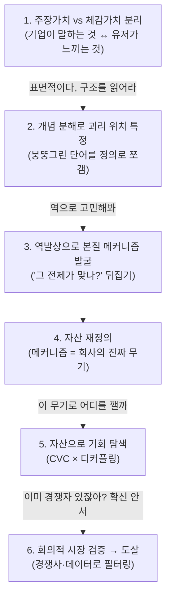

# 분석 사고법: 표면 → 구조 → 본질 메커니즘

> 강사님의 실제 심문 대화에서 추출한 **재사용 가능한 사고 틀**.
> "현상 나열"에 머무는 분석을 "구조적 본질"까지 끌어내리는 반복 방법.
> 어떤 기업/제품 분석에도 적용 가능.
>
> **두 겹의 재구성**
> - **§1~4 = 기업 본질 메커니즘** (소스 01: 당근 대화). *무엇이 회사의 진짜 무기인가*를 판다.
> - **§5 = 심문 엔진 + 인식론 필터** (소스 02: [오늘의집](./sources/instructor-dialogue-02-todayhome.md) · 소스 03: [쿠팡](./sources/instructor-dialogue-03-coupang.md)). *강사님이 AI를 어떻게 정직하게 만드는가* — 3개 대화를 가로지르는 반복 수(手)를 학습한 것.

---

## 0. 핵심 명제

- 좋은 분석은 **AI의 출력이 아니라, AI를 미는 사람의 질문**에서 나온다.
- 첫 답에 만족하지 말 것. **매 단계 한 겹씩 더 깊이** 내려간다.
- 목표는 *무엇이 일어나는가(현상)* 가 아니라 *왜 그렇게 작동하는가(구조)* 다.

---

## 1. 6단계 사고 궤적

각 단계는 **이전 단계의 '표면'을 깨면서** 내려간다. 한 번에 정답이 아니라 **반복(iteration)**으로 깊이를 만든다.

---

## 2. 각 단계의 질문 (체크리스트)

### ① 주장가치 vs 체감가치 분리
- 기업이 **공식적으로 주장**하는 가치는? (비전·슬로건·메시징)
- 유저가 **실제로 느끼는** 가치는? (기능·후기·행동 데이터)
- 둘 사이의 **Gap**은? → *이 Gap이 분석의 광맥*
- *(당근: "로컬의 모든 것을 연결" ↔ "업자 없는 깨끗한 직거래")*

### ② 개념 분해로 괴리 위치 특정
- 분석을 막는 **뭉뚱그린 단어**는? (예: "신뢰", "연결", "가치")
- 그걸 둘 이상으로 **쪼개면**? → 어느 조각이 진짜이고 어느 게 미검증인가?
- *(당근: "신뢰" → 거래신뢰(작동) ≠ 관계신뢰(미검증))*

### ③ 역발상으로 본질 메커니즘 발굴 ⭐ 가장 중요
- 모두가 믿는 **전제를 뒤집어** 본다: *"X = Y가 정말 맞나?"*
- 상관(표면 스토리)과 **진짜 인과(구조)**를 분리한다.
- *(당근: "동네=신뢰?" 뒤집기 → 진짜는 신뢰가 아니라 **억제**(나쁜 행동의 비용을 높인 설계 = 도망 못 감))*
- 도구: 5 Why · 메타인지 · 제1원칙 ([W1 §8](./W1-company-analysis-frameworks.md))

### ④ 자산 재정의
- 본질 메커니즘을 알면 **회사의 핵심 자산 정의가 바뀐다**.
- "감성적 표현" → "구조적 능력"으로 다시 쓴다.
- *(당근: "동네의 따뜻함" → "나쁜 행동을 비싸게 만드는 설계 능력")*
- ⚠️ **자기잠식 체크**: 수익화가 *바로 그 핵심 자산을 침식*하고 있지 않은가?
  - *(당근: 수익화(알바·비즈프로필·모임)가 억제 구조를 무력화 / 화해: 커머스 푸시가 신뢰를 훼손 — **동일 패턴**)*

### ⑤ 자산으로 기회 탐색 (CVC × 디커플링)
- 인접 시장의 **고객 밸류 체인(CVC)**을 펼친다: 인식→탐색→평가→선택→거래→사후→재이용
- 각 단계에서 **정보 비대칭·신뢰 부재로 인한 고통**이 큰 지점은?
- 그 고통을 **우리 자산(메커니즘)이 구조적으로 해소**할 수 있는가?
- 둘 다 성립하는 지점 = **디커플링 기회** ([W1 §5](./W1-company-analysis-frameworks.md))

### ⑥ 회의적 시장 검증 → 도살
- 후보를 **그냥 믿지 말고** 경쟁사·시장 데이터로 재평가.
- 탈락 기준: ① 경쟁자가 이미 유사 메커니즘 구축, ② **진짜 Job이 우리 무기와 무관**.
- *(당근: 과외 탈락 — 김과외 선점 + "과외의 Job은 동네가 아니라 실력")*
- 도구: JTBD(진짜 Job 확인) · 경쟁 분석 · 시장 규모

---

## 3. 코칭 패턴 (스스로에게 던질 질문)

분석이 얕다고 느껴질 때, 강사가 던진 질문을 **자신에게** 던진다:

| 멈춤 신호 | 던질 질문 |
|---|---|
| 현상만 나열하고 있다 | "이게 **왜** 그렇게 작동하지? 구조는?" |
| 막연한 단어로 설명 중 | "이 단어를 **쪼개면** 뭐가 진짜지?" |
| 통념을 그대로 받아들임 | "그 전제가 **정말 맞나? 뒤집으면**?" |
| 아이디어에 들떠 있다 | "**경쟁자가 이미** 하고 있지 않나?" |
| 확신이 안 선다 | "**시장 데이터로 검증**했나?" |

> 💡 핵심: **AI의 답을 한 번도 그대로 받지 않는다.** 매번 비판하고 재요구한다.
> = 실습 원칙 *"AI의 생성 내용을 비판적으로 바라보며 판단·해석은 본인이 한다"* 의 실천.

---

## 4. 전이 가능한 구조적 패턴 (여러 기업에서 반복)

1. **주장-체감 Gap**: 거의 모든 기업에 존재. 먼저 찾을 것.
2. **표면 스토리 ≠ 진짜 메커니즘**: 감성적 서사(따뜻함·신뢰) 뒤에 구조적 원리(억제·이해관계 부재)가 있다.
3. **자기잠식**: 수익화가 핵심 자산을 소모하는 구조 — **당근(억제↓)·화해(신뢰↓) 공통**. 발견하면 가장 본질적인 진단.
4. **진짜 Job 확인**: 확장이 막히는 곳은 보통 "우리 무기 ≠ 그 시장의 진짜 Job"인 지점.

---

## 5. 강사님 = 심문 엔진 (3개 대화에서 학습: 당근·오늘의집·쿠팡)

> §1~4가 *분석의 궤적*(무엇을 파는가)이라면, 이 절은 *대화로 깊이를 만드는 심문 엔진*(어떻게 계속 파는가)다.
> 세 대화를 가로질러 **반복해서 나타나는 강사님의 수(手)**를 뽑아, 강사님이라는 사람을 **분석 결과물에 들이대는 렌즈(툴)** 로 재구성한 것이다.
> 소스: 당근([§1~4] 기업 본질 메커니즘) · [오늘의집](./sources/instructor-dialogue-02-todayhome.md)(지표·제안의 인식론) · [쿠팡](./sources/instructor-dialogue-03-coupang.md)(VOC→본질 가치→시스템→본질 Job).
>
> **강사님의 정체 = 첫 답을 거부하는 사람.** 프레임워크를 아는 게 아니라, *AI의 답도 자기 자신의 영향력도 그대로 받지 않는* 태도가 본질이다.

### 5.1 강사님의 심문 4국면 (반복되는 手의 지도)

한 번의 좋은 질문이 아니라 **점점 조이는 연쇄**로 깊이를 만든다. 세 대화의 수들은 4국면으로 뭉친다. 각 수는 앞 답의 '표면'을 깬다.

| 국면 | 강사님의 수 (실제 발화 예) | 강제한 규율 |
|---|---|---|
| **A. 바닥 다지기** | "**실제로 검색해서 정확하게**"(쿠팡) / "실제 자료 기반으로"(오늘의집) | 근거 강제 — 원자료에 발 딛기, 추측 금지 |
| | "비즈니스 말고 **고객 가치·인간의 기본 욕구**로, **본질적으로**"(오늘의집) | 기본값 관점 갈아끼우기 |
| | "**행동 관찰**과 **감정 공감**을 각각 모아 그 안에서 **가치 패턴**을"(쿠팡) | 뭉치기 전에 결을 나눠 수집 |
| **B. 본질 파기** | ⭐ "**'통제감'을 판다는 가설로 BM 전체를 다시 읽어라**"(쿠팡) | 하나의 렌즈로 통째 재해석 (=역발상 ③) |
| | "생태계 + **측정 데이터 구조**는?"(오늘의집) / "**시스템적 사고**로 전체 종합 결론"(쿠팡) | 추상 주장을 인과 루프·측정 가능 지표로 착지 |
| **C. 정직성 검문** | ⭐ "**표면적이다, 본질과 논리로 연결해**"(오늘의집) / "**이 회사만의 게 아냐, 나이브해**"(쿠팡) | 표면·범용 기각 |
| | ⭐ "**임의로 만든 거 아냐? 스스로 검증해**"(오늘의집) | 자작 검증 강제 |
| | ⭐ "**너 나한테 편향된 거 아냐? 확실한 것만**"(오늘의집) | 반(反)-아부 + 사실/추론 분리 |
| **D. 실전화** | "각 BM이 그 가치 **못 주는 부분**을 객관 사실로 비판"(오늘의집) | 본질 가치를 잣대로 현 사업 감사 (④ 자기잠식) |
| | "그럼 **PM으로서 뭘 설계**?"(오늘의집) | 진단 → 처방 |
| | ⭐ "**이걸 어떻게 하게 만들지 근본 설계. 초기 동기 이상으로**"(오늘의집) | 적재하중 가정 저격 |

> ⭐ = 세 대화에서 반복되며 깊이를 만든 결정적 수. 국면은 고정 순서가 아니라 **필요할 때 다시 A로 되돌아가는 나선**이다(쿠팡: D단계 JTBD를 낸 뒤 다시 "나이브해"로 C로 회귀 → 본질 Job으로 수렴).

### 5.2 인식론 필터 6개 = 진짜 "분석 툴"

국면 B·C가 강제한 것을 규칙으로 굳히면, 분석/지표/제안의 **품질 검문소** 6개가 된다.

1. **반증가능성 필터** — *"이 숫자가 더 평범한 이유로도 똑같이 나오나?"* 나오면 버린다.
   - 살아남는 지표엔 **통제·반사실(counterfactual)이 내장**돼 있다. (예: 콘텐츠는 고정, "반응 유무"만 변수 → 자연실험)
   - 죽는 지표: 선택편향·필터버블·기능적 정합성 같은 **대안 설명으로도 같은 숫자**가 나오는 것.
2. **범용성 기각 (유니크성 필터)** — *"이 분석, 경쟁사 이름만 바꿔 그대로 복붙되나?"* 되면 버린다.
   - 범용 답을 걷어내고 **이 회사만의 것**으로 수렴시킨다. (쿠팡: 6개 Job → 단일 Core Job "맡기면 된다"; 오늘의집: 범용 그로스 지표 L1~4 → A·B·C)
   - "표면적이다"와 "나이브하다"는 **같은 압박** — *아무 데나 붙는 템플릿인가, 이 대상의 구조인가.*
3. **자작 탐지** — *그럴듯함 ≠ 근거.* AI가 스스로 "이 결과를 낳는 다른 설명"을 죽이지 못하면 그건 임의생성이다.
   - 강사님은 답을 직접 반박하지 않는다. **"스스로 검증해봐"**로 자기감사를 시킨다.
4. **반(反)-아부 점검** — *비판자 자신도 의심한다:* "AI가 내 말에 그냥 굴복하는 것 아닌가?"
   - 심문의 목적은 동의를 받아내는 게 아니라 **진짜 추론이 살아있는지** 확인하는 것.
5. **사실/추론 분리** — 결과물은 **확인된 사실 vs 논리적 추론**을 표로 갈라야 한다. 섞이면 확신이 오염된다.
6. **적재하중 가정 저격** — 제안이 통째로 기대는 **단 하나의 가정**을 찾아 뿌리부터 다시.
   - (오늘의집: "사람들이 정말 업로드할까?" → 동기를 강화할 게 아니라 **동기가 필요 없게** 설계.)

### 5.3 이걸 툴로 쓰는 법 (자기 심문 순서)

분석·지표·제안을 내놓았을 때, **강사님이 되어 자신에게** 던진다:

| 검문소 | 스스로에게 던질 질문 |
|---|---|
| 연결 | "표면이다 — 이걸 **본질과 논리로** 이어봤나?" |
| 범용성 기각 | "이 분석, **경쟁사에 그대로 복붙**되나? 이 회사만의 건가?" |
| 반증가능성 | "이 지표, **다른 평범한 이유로도** 똑같이 나오지 않나?" |
| 자작 탐지 | "이거 **내가 지어낸 것** 아닌가? 대안 설명을 죽였나?" |
| 반-아부 | "나 지금 상대 말에 **그냥 맞춰주는** 것 아닌가?" |
| 사실/추론 | "**확인된 사실과 추론**을 갈랐나?" |
| 적재하중 | "이 제안은 어떤 **단일 가정에 목숨** 걸고 있지?" |

> 💡 관통 원칙: 강사님은 **AI의 답도, 자기 자신의 영향력도 그대로 받지 않는다.**
> §3의 "AI 답을 한 번도 그대로 받지 않는다"에 **"내 비판조차 그대로 믿지 않는다"**(반-아부)가 더해진 것.

### 5.4 세 대화가 검증한 구조 패턴 (§1~4와의 접점)

심문 엔진은 새 도구만 더한 게 아니라 앞 프레임을 **실전 재현**했다:
- **자기잠식(④) — 이제 4번째 사례.** 수익화가 핵심 자산을 침식하는 **동일 패턴**:
  - 당근(수익화가 억제↓) · 화해(커머스 푸시가 신뢰↓) · 오늘의집(시공·자체브랜드가 A·B·C↓) · **쿠팡(B1 수익화 루프가 R1 성장 루프의 신뢰를 잠식)**.
  - 발견하면 가장 본질적인 진단. 4개 회사에서 일관되게 나온다.
- **역발상(③) — 가설 주도 재해석으로 구체화.** "동네=신뢰?"(당근) · "MAU 37%↓인데 매출↑?"(오늘의집) · "'통제감'을 판다는 가설로 전체를 다시"(쿠팡).
- **진짜 Job 확인(⑥).** "표준계약서는 '사기 안 침'은 풀지만 '내 상황에서 잘할까'는 못 푼다"(오늘의집) · "6개 Job → 단일 Core Job로 수렴"(쿠팡).

---

*연계: [W1 프레임워크](./W1-company-analysis-frameworks.md)(5Why·시스템사고·JTBD·디커플링) · 소스: 당근(§1~4) · [오늘의집](./sources/instructor-dialogue-02-todayhome.md) · [쿠팡](./sources/instructor-dialogue-03-coupang.md) · 적용 예: [화해 분석](../analysis/hwahae/README.md)*
