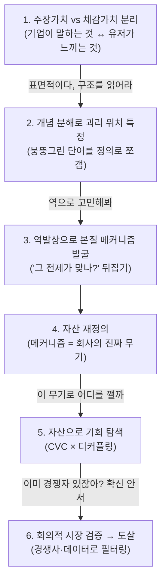

# 분석 사고법: 표면 → 구조 → 본질 메커니즘

> 강사님의 당근(Karrot) 분석 대화에서 추출한 **재사용 가능한 사고 틀**.
> "현상 나열"에 머무는 분석을 "구조적 본질"까지 끌어내리는 반복 방법.
> 어떤 기업/제품 분석에도 적용 가능. (워크드 예시 = 당근)

---

## 0. 핵심 명제

- 좋은 분석은 **AI의 출력이 아니라, AI를 미는 사람의 질문**에서 나온다.
- 첫 답에 만족하지 말 것. **매 단계 한 겹씩 더 깊이** 내려간다.
- 목표는 *무엇이 일어나는가(현상)* 가 아니라 *왜 그렇게 작동하는가(구조)* 다.

---

## 1. 6단계 사고 궤적

각 단계는 **이전 단계의 '표면'을 깨면서** 내려간다. 한 번에 정답이 아니라 **반복(iteration)**으로 깊이를 만든다.

---

## 2. 각 단계의 질문 (체크리스트)

### ① 주장가치 vs 체감가치 분리
- 기업이 **공식적으로 주장**하는 가치는? (비전·슬로건·메시징)
- 유저가 **실제로 느끼는** 가치는? (기능·후기·행동 데이터)
- 둘 사이의 **Gap**은? → *이 Gap이 분석의 광맥*
- *(당근: "로컬의 모든 것을 연결" ↔ "업자 없는 깨끗한 직거래")*

### ② 개념 분해로 괴리 위치 특정
- 분석을 막는 **뭉뚱그린 단어**는? (예: "신뢰", "연결", "가치")
- 그걸 둘 이상으로 **쪼개면**? → 어느 조각이 진짜이고 어느 게 미검증인가?
- *(당근: "신뢰" → 거래신뢰(작동) ≠ 관계신뢰(미검증))*

### ③ 역발상으로 본질 메커니즘 발굴 ⭐ 가장 중요
- 모두가 믿는 **전제를 뒤집어** 본다: *"X = Y가 정말 맞나?"*
- 상관(표면 스토리)과 **진짜 인과(구조)**를 분리한다.
- *(당근: "동네=신뢰?" 뒤집기 → 진짜는 신뢰가 아니라 **억제**(나쁜 행동의 비용을 높인 설계 = 도망 못 감))*
- 도구: 5 Why · 메타인지 · 제1원칙 ([W1 §8](./W1-company-analysis-frameworks.md))

### ④ 자산 재정의
- 본질 메커니즘을 알면 **회사의 핵심 자산 정의가 바뀐다**.
- "감성적 표현" → "구조적 능력"으로 다시 쓴다.
- *(당근: "동네의 따뜻함" → "나쁜 행동을 비싸게 만드는 설계 능력")*
- ⚠️ **자기잠식 체크**: 수익화가 *바로 그 핵심 자산을 침식*하고 있지 않은가?
  - *(당근: 수익화(알바·비즈프로필·모임)가 억제 구조를 무력화 / 화해: 커머스 푸시가 신뢰를 훼손 — **동일 패턴**)*

### ⑤ 자산으로 기회 탐색 (CVC × 디커플링)
- 인접 시장의 **고객 밸류 체인(CVC)**을 펼친다: 인식→탐색→평가→선택→거래→사후→재이용
- 각 단계에서 **정보 비대칭·신뢰 부재로 인한 고통**이 큰 지점은?
- 그 고통을 **우리 자산(메커니즘)이 구조적으로 해소**할 수 있는가?
- 둘 다 성립하는 지점 = **디커플링 기회** ([W1 §5](./W1-company-analysis-frameworks.md))

### ⑥ 회의적 시장 검증 → 도살
- 후보를 **그냥 믿지 말고** 경쟁사·시장 데이터로 재평가.
- 탈락 기준: ① 경쟁자가 이미 유사 메커니즘 구축, ② **진짜 Job이 우리 무기와 무관**.
- *(당근: 과외 탈락 — 김과외 선점 + "과외의 Job은 동네가 아니라 실력")*
- 도구: JTBD(진짜 Job 확인) · 경쟁 분석 · 시장 규모

---

## 3. 코칭 패턴 (스스로에게 던질 질문)

분석이 얕다고 느껴질 때, 강사가 던진 질문을 **자신에게** 던진다:

| 멈춤 신호 | 던질 질문 |
|---|---|
| 현상만 나열하고 있다 | "이게 **왜** 그렇게 작동하지? 구조는?" |
| 막연한 단어로 설명 중 | "이 단어를 **쪼개면** 뭐가 진짜지?" |
| 통념을 그대로 받아들임 | "그 전제가 **정말 맞나? 뒤집으면**?" |
| 아이디어에 들떠 있다 | "**경쟁자가 이미** 하고 있지 않나?" |
| 확신이 안 선다 | "**시장 데이터로 검증**했나?" |

> 💡 핵심: **AI의 답을 한 번도 그대로 받지 않는다.** 매번 비판하고 재요구한다.
> = 실습 원칙 *"AI의 생성 내용을 비판적으로 바라보며 판단·해석은 본인이 한다"* 의 실천.

---

## 4. 전이 가능한 구조적 패턴 (여러 기업에서 반복)

1. **주장-체감 Gap**: 거의 모든 기업에 존재. 먼저 찾을 것.
2. **표면 스토리 ≠ 진짜 메커니즘**: 감성적 서사(따뜻함·신뢰) 뒤에 구조적 원리(억제·이해관계 부재)가 있다.
3. **자기잠식**: 수익화가 핵심 자산을 소모하는 구조 — **당근(억제↓)·화해(신뢰↓) 공통**. 발견하면 가장 본질적인 진단.
4. **진짜 Job 확인**: 확장이 막히는 곳은 보통 "우리 무기 ≠ 그 시장의 진짜 Job"인 지점.

---

*연계: [W1 프레임워크](./W1-company-analysis-frameworks.md)(5Why·시스템사고·JTBD·디커플링) · 적용 예: [화해 분석](../analysis/hwahae/README.md)*
